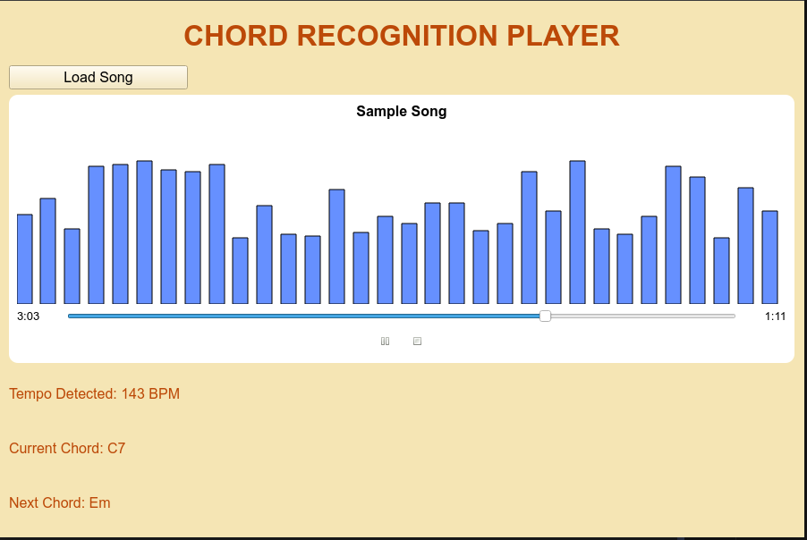
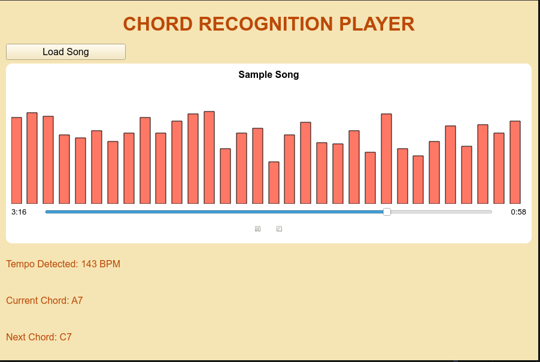

# Chord Recognition Player 
This is a desktop application that analyze user's uploaded song, detects its chords, tempo, beat structures, and allow users to see those while listening to audio playback through my homemade audio player with an animated spectrum display.


# Features
- Automatic chord recognition: currently this app support most popular major, minor, 7th and sus4 chords
- Chords display: show current and next chords during the playback
- Beat and tempo detection: show every tempo changes
- Real-time spectrum visualizer: audio energy (loudness) visualized with color-shifting bars
- Audio player: timeline tracking with play/pause and stop buttons

# How it work (current version)
1. Audio processing: This app loads user's uploaded audio and extracts the following:
    - Chroma features: energy distribution across 12 pitch class (C, C#, D, Eb,...)
    - Onset envelope: estimate beats and local tempo variations

2. Chord detection: For each beat interval, the app:
    - Compute the average chroma vector
    - Compare it to the CHORD_TEMPLATES dictionary
    - Choose the chord with the best match

3. Tempo tracking: Detect global BPM (beats per minute) and local tempo changes throughout the song

4. Spectrum visualization: This app uses computed STFT energy data (loudness) to display a color-changing bar sync with playback

5. UI synchronization: Throughout the playback, the app updates the chord, tempo and timeline every 200ms

# Tech Stack
- Language: Python 3
- Frontend + visualization: PyQt5
- Audio analysis: librosa
- Audio playback: QMediaPlayer

# Installation 
1. Clone the repo

```bash
    git clone https://github.com/tinngo777/chords-recognition.git
    cd chords-recognition
```

2. Install dependencies
```bash
    pip install -r requirements.txt
```

3. Run app
```bash
    python3 main.py
```
4. Load song
    
    Click "Load Song" button then choose mp3, mp4 or wav file, wait til the song name appear then hit Play button


# Some note from creator 
- The chord template does not cover every chords in existence (please go to Ultimate Guitar and search for any jazz song), I'll try to update the templates as much as possible but this current variation of the app will definitely struggle against complex songs with many layers or complex chords.
- Tempo: the tempo is approximate, it won't be perfect for a live performance 
- Spectrum: As I've mentioned, the bars represent the loudness during the playback, not the actual frequency

# Planned Improvement
- As I said, I'll definitely update more chords and find ways to make the chords display as accurate as possible, and reduce the constant chords changing that sometimes display during the playback 

